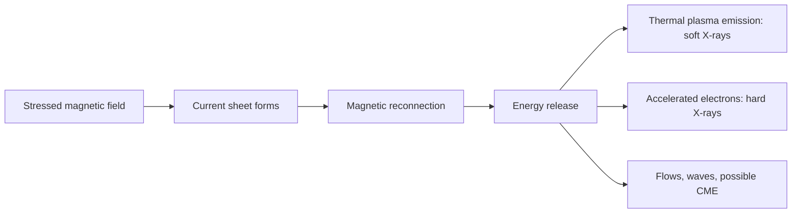

# Orbitomics SOLAR FORECASTING / NOWCASTING 

**Project:** ISRO Bharatiya Antariksh Hackathon 2026, Challenge 15  
**Topic:** Forecasting and/or nowcasting of solar flares using combined soft and hard X-ray data from Aditya-L1  
**Prepared for:** Orbitomics  
**Scope:** Phase 1 to Phase 4 only. This document does not choose a final architecture.

## Executive Summary

Solar flares are rapid releases of magnetic energy in the solar atmosphere. They are important scientifically because they reveal how magnetic energy is stored and explosively converted into plasma heating, particle acceleration, and radiation. They are important operationally because intense flares can affect radio communication, satellites, navigation, aviation operations, astronauts, and the near-Earth space environment.

Most modern AI solar-flare forecasting research uses SDO/HMI active-region magnetograms, especially the SHARP feature set, with GOES soft X-ray flare labels. Deep learning work increasingly uses CNNs, LSTMs, transformers, full-disk imagery, and explainability methods. However, many systems are still limited by class imbalance, inconsistent event definitions, temporal data leakage risks, weak cross-cycle generalization, insufficient uncertainty estimates, high false-alarm rates, and limited use of hard X-ray information.

Aditya-L1 is strategically relevant because it carries complementary solar X-ray payloads. SoLEXS observes soft X-rays and HEL1OS observes hard X-rays. Soft X-rays are closely associated with thermal plasma emission, while hard X-rays are linked to non-thermal particle acceleration during flares. The hackathon challenge's emphasis on combined soft and hard X-ray data is therefore scientifically meaningful: it points toward multi-band temporal learning, precursor detection, flare phase recognition, and uncertainty-aware nowcasting.

The strongest research-backed direction for Orbitomics is a **dual-band soft plus hard X-ray forecasting/nowcasting framework** that treats SoLEXS and HEL1OS as complementary time-series sensors, extracts physically interpretable temporal features, and produces calibrated flare-risk outputs with explanations and confidence estimates. A 30-hour hackathon version should prioritize a clear prototype with defensible physics, transparent evaluation, and strong visual storytelling over an oversized black-box model.

---

# Phase 1: Understand the Science

## 1. Solar Flares

### What Solar Flares Are

A solar flare is a sudden, intense release of energy from the Sun's atmosphere, usually near magnetically complex active regions. Flares emit radiation across the electromagnetic spectrum, including radio, visible, ultraviolet, extreme ultraviolet, soft X-rays, hard X-rays, and gamma rays. Operational flare classification is commonly based on the peak soft X-ray flux measured by GOES in the 1-8 Angstrom channel [R1, R2].

Flares are not simply "bright spots." They are dynamic magnetic explosions. Energy stored in stressed solar magnetic fields is converted into:

- plasma heating,
- accelerated electrons and ions,
- electromagnetic radiation,
- plasma flows,
- sometimes associated eruptions such as coronal mass ejections.

### How Flares Are Generated

The Sun's photosphere contains magnetic fields that emerge, shear, twist, and interact. In active regions, opposite magnetic polarities can become packed together along polarity inversion lines. Solar convection and differential rotation stress these fields. When magnetic stress exceeds the ability of the configuration to remain stable, the field can rapidly restructure.

The central physical mechanism is **magnetic reconnection**. In reconnection, magnetic field lines break and reconnect into lower-energy configurations. The released magnetic energy heats plasma and accelerates particles [R3].

### Magnetic Reconnection

Conceptually:

In a typical flare scenario, accelerated electrons stream along magnetic loops and collide with denser plasma in the chromosphere. This produces hard X-ray bremsstrahlung emission. The heated chromospheric plasma expands upward into coronal loops, producing enhanced soft X-ray emission. This is one reason hard X-rays often trace impulsive non-thermal energy release, while soft X-rays trace the thermal response.

### Flare Classes

GOES soft X-ray flare classes are logarithmic. Each class is ten times stronger in peak 1-8 Angstrom flux than the previous class [R1, R2].

| Class | Peak GOES 1-8 Angstrom Flux at Earth | Interpretation |
|---|---:|---|
| A | < 1e-7 W/m2 | Very small |
| B | 1e-7 to < 1e-6 W/m2 | Small |
| C | 1e-6 to < 1e-5 W/m2 | Minor |
| M | 1e-5 to < 1e-4 W/m2 | Moderate; can affect radio systems |
| X | >= 1e-4 W/m2 | Major; strongest operational class |

An X2 flare is twice the peak flux of an X1 flare. An M5 flare is half the peak flux of an X1 flare.

### Typical Flare Lifecycle

| Stage | Physical Meaning | Common Observational Signatures |
|---|---|---|
| Pre-flare | Magnetic stress accumulates; precursors may appear | Active-region complexity, small brightenings, flux emergence, shearing |
| Impulsive phase | Rapid particle acceleration and energy release | Hard X-rays, microwave bursts, fast rise in emission |
| Gradual phase | Heated plasma cools and loops brighten | Soft X-ray enhancement, EUV loops, decay phase |
| Recovery | Atmosphere relaxes; emission returns toward background | Soft X-ray decay, post-flare arcades |

### Physical Characteristics Relevant to AI

Important flare-prediction signals include:

- **magnetic complexity:** strong gradients, mixed polarities, high shear,
- **stored free magnetic energy:** proxy for available flare energy,
- **temporal evolution:** rapid changes in magnetic or X-ray signals,
- **precursors:** small brightenings or micro-events before larger flares,
- **multi-band timing:** hard X-ray peaks can precede or coincide with impulsive release, while soft X-rays often respond more gradually.

For Aditya-L1, the most relevant distinction is:

| Band | Approximate Physical Role | Forecasting Value |
|---|---|---|
| Soft X-ray | Thermal plasma response | Flare onset, magnitude class, thermal evolution |
| Hard X-ray | Non-thermal accelerated particles | Impulsive energy release, early flare phase, particle acceleration |

---

## 2. Space Weather

### What Space Weather Is

Space weather refers to variable conditions on the Sun and in the heliosphere that can affect Earth, spacecraft, technology, and human activity. It includes solar radiation storms, geomagnetic storms, radio blackouts, and disturbances driven by solar wind structures, flares, CMEs, and solar energetic particle events [R4, R5].

### Components of Space Weather

| Component | Source | Main Effect |
|---|---|---|
| Solar flare | Sudden radiation from solar atmosphere | Radio blackouts, ionospheric disturbances |
| Coronal mass ejection | Large plasma and magnetic-field eruption | Geomagnetic storms if Earth-directed |
| Solar energetic particles | High-energy particles from flares and shocks | Radiation hazard to spacecraft and astronauts |
| High-speed solar wind stream | Coronal holes | Geomagnetic activity |

### Solar Flares vs CMEs vs SEP Events

| Event Type | What It Is | Travel Time to Earth | Primary Hazards |
|---|---|---:|---|
| Solar flare | Electromagnetic radiation burst | About 8 minutes | Radio blackouts, ionosphere disruption |
| CME | Massive plasma and magnetic field eruption | About 1 to 4 days | Geomagnetic storms, grid effects, satellite drag |
| SEP event | Energetic particles | Minutes to hours | Radiation exposure, spacecraft electronics risk |

Solar flares and CMEs often occur together but are physically distinct. A flare is radiation from energy release; a CME is expelled plasma and magnetic field. A large flare does not guarantee a CME, and a CME can occur without a major flare [R5].

### Effects on Technology and Human Systems

| System | Possible Impact |
|---|---|
| Satellites | Surface charging, single-event upsets, solar-panel degradation, drag during geomagnetic storms |
| Astronauts | Increased radiation exposure, especially outside Earth's magnetosphere |
| Aviation | Polar-route communication disruption and radiation dose concerns during major events |
| GPS/GNSS | Ionospheric scintillation, positioning errors, signal loss |
| Communication | HF radio blackouts from enhanced ionization in the dayside ionosphere |
| Power grids | Geomagnetically induced currents during geomagnetic storms |

---

## 3. Why Solar Flare Prediction Matters

### Operational Importance

Forecasting and nowcasting help operators prepare for high-risk conditions:

- satellite operators can shift modes or delay maneuvers,
- aviation planners can adjust polar routes,
- communication providers can anticipate radio blackout risk,
- space agencies can reduce astronaut radiation exposure,
- navigation users can account for ionospheric disruption.

### Scientific Importance

Prediction forces researchers to identify which observable features actually encode flare readiness. A good forecasting model is not only a classifier; it is a hypothesis about solar physics.

### Why Early Prediction Is Valuable

Flares themselves reach Earth electromagnetically in about 8 minutes, so a fully developed flare cannot provide long warning for radiation effects at Earth. This is why precursor-based forecasting matters. Even a few hours of warning can be valuable for operational planning.

### Current Challenges

The literature repeatedly identifies several difficulties:

- major flares are rare, creating severe class imbalance,
- active regions evolve continuously, so train/test splitting can leak temporal information,
- different papers use different event definitions and forecast windows,
- high accuracy can be misleading when non-flaring examples dominate,
- false alarms remain operationally expensive,
- models trained on one solar cycle or instrument can generalize poorly,
- deep models often lack uncertainty and interpretability.

---

## 4. ISRO and Aditya-L1

### Mission Overview

Aditya-L1 is India's first dedicated solar observatory mission. ISRO describes it as a spacecraft placed in a halo orbit around the Sun-Earth L1 point, about 1.5 million km from Earth. From L1, the spacecraft can observe the Sun continuously without regular occultations by Earth [R6].

Aditya-L1 was launched on September 2, 2023, and inserted into its halo orbit around L1 on January 6, 2024 [R6].

### Mission Objectives

The mission studies:

- the solar corona,
- chromospheric and coronal heating,
- solar wind and particle dynamics,
- coronal mass ejections,
- solar flares,
- magnetic-field and plasma conditions relevant to space weather.

### Payload Overview

Aditya-L1 carries seven payloads. The payloads include remote-sensing instruments that observe the Sun and in-situ instruments that sample particles and fields near L1 [R6].

| Payload | General Role |
|---|---|
| VELC | Visible emission line coronagraph |
| SUIT | Solar ultraviolet imaging telescope |
| SoLEXS | Solar low-energy X-ray spectrometer |
| HEL1OS | High-energy L1 orbiting X-ray spectrometer |
| ASPEX | Solar wind particle experiment |
| PAPA | Plasma analyzer package |
| MAG | Magnetometer |

### Why Aditya-L1 Is Suitable for Flare Forecasting and Nowcasting

Aditya-L1 is relevant for flare work because it provides:

- continuous solar observing geometry from L1,
- soft X-ray spectroscopy through SoLEXS,
- hard X-ray spectroscopy through HEL1OS,
- contextual solar observations through other payloads,
- space-weather-relevant measurements from a stable Sun-Earth vantage point.

For Challenge 15, the most distinctive asset is the **combined soft plus hard X-ray view**. Many published AI forecasting studies use magnetograms plus GOES labels. A model that learns from Aditya-L1 X-ray temporal behavior can be positioned as complementary rather than derivative.

---

## 5. SoLEXS

### Instrument and Working Principle

SoLEXS stands for Solar Low Energy X-ray Spectrometer. It is designed to measure solar soft X-ray emission from the Sun. Recent calibration and in-flight performance work reports that SoLEXS observes the 2-22 keV band with 1-second temporal cadence using silicon drift detector technology [R7].

Soft X-ray photons entering the detector generate charge proportional to photon energy. The instrument accumulates spectra and count rates that describe the Sun's X-ray brightness and spectral evolution.

### Data and Scientific Relevance

| Aspect | SoLEXS Relevance |
|---|---|
| Energy band | Soft X-ray coverage, 2-22 keV as reported in recent calibration work [R7] |
| Physical sensitivity | Hot thermal plasma during flares |
| Output | X-ray spectra, count rates, light curves, flare evolution |
| Forecasting use | Onset detection, flare class estimation, thermal evolution, precursor signatures |

### Why SoLEXS Matters for AI

Soft X-rays encode flare thermal evolution and are closely tied to operational flare class labels. For machine learning, SoLEXS can support:

- time-series classification,
- onset detection,
- flare phase segmentation,
- regression to peak flux or fluence,
- anomaly detection in pre-flare light curves.

---

## 6. HEL1OS

### Instrument and Working Principle

HEL1OS stands for High Energy L1 Orbiting X-ray Spectrometer. It is intended to observe hard X-ray emission from solar flares from Aditya-L1's L1 vantage point. Recent instrument work reports time-resolved spectra from about 8 keV to 150 keV using CdTe and CZT detectors [R8].

Hard X-rays are especially important during the impulsive phase of flares because energetic electrons colliding with denser solar atmosphere produce bremsstrahlung radiation.

### Data and Scientific Relevance

| Aspect | HEL1OS Relevance |
|---|---|
| Energy band | Hard X-ray coverage, about 8-150 keV as reported in recent instrument work [R8] |
| Physical sensitivity | Non-thermal electron acceleration and impulsive energy release |
| Output | Hard X-ray count rates, spectra, timing information |
| Forecasting use | Impulsive-phase detection, flare severity clues, timing relation to SoLEXS |

### Why HEL1OS Matters for AI

Hard X-ray information is underused in many AI flare forecasting papers compared with soft X-ray labels and magnetograms. HEL1OS creates an opportunity to frame the project around **multi-band X-ray temporal learning**, especially:

- hard-to-soft timing relationships,
- impulsive-phase signatures,
- flare phase classification,
- early severity estimation,
- physically explainable multi-sensor alerts.

---

## 7. Forecasting vs Nowcasting

| Term | Meaning | Example |
|---|---|---|
| Forecasting | Predicting a future event before it starts | "Will an M-class flare occur in the next 24 hours?" |
| Nowcasting | Estimating the current state or immediate evolution using real-time data | "Is this active X-ray rise becoming a significant flare now?" |

### Which One the Challenge Likely Expects

Because the challenge says "forecasting and/or nowcasting" and specifically mentions combined soft and hard X-ray data, a strong hackathon interpretation is:

- **forecasting:** use pre-event soft/hard X-ray temporal patterns to estimate flare probability within a defined horizon,
- **nowcasting:** use real-time SoLEXS and HEL1OS signals to detect onset, classify flare phase, estimate severity, and update risk continuously.

For a 30-hour hackathon, nowcasting plus short-horizon forecasting may be more feasible than long-horizon active-region prediction, because the required inputs are directly aligned with the specified X-ray instruments.

---

# Phase 2: Existing Research, State of the Art

## Literature Survey Matrix

The table below emphasizes papers and resources that are useful for Challenge 15. Some use magnetograms rather than X-ray time series; they are included because they define the dominant state of the art and reveal gaps that an Aditya-L1 X-ray approach can address.

| # | Paper | Dataset | Input Modality | Model | Target | Lead Time | Metrics | Strength | Limitation |
|---:|---|---|---|---|---|---|---|---|---|
| 1 | Bobra and Couvidat, 2015, "Solar Flare Prediction Using SDO/HMI Vector Magnetic Field Data" [R9] | SDO/HMI SHARP, GOES labels | Vector magnetic-field features | SVM | >=M/X flare occurrence | 24 h | TSS, HSS | Seminal SHARP ML baseline | Hand-crafted features; limited deep temporal modeling |
| 2 | Nishizuka et al., 2017, "Solar Flare Prediction Model with Three Machine-Learning Algorithms" [R10] | SDO/HMI, GOES, solar observations | Magnetic and flare-history features | SVM, kNN, extremely randomized trees | C/M/X flares | 24 h | TSS, HSS, accuracy | Compared multiple classical models | Risk of dataset and splitting sensitivity |
| 3 | Nishizuka et al., 2018/2021, Deep Flare Net operational forecasting [R11] | SDO/HMI, GOES | Active-region parameters | DNN operational system | C/M/X flare forecast | 24 h | TSS, HSS, reliability | Operationally oriented probability forecasting | Still mainly magnetogram/statistical features |
| 4 | SWAN-SF benchmark testbed, described in Ahmadzadeh et al. and Yeolekar et al. [R13, R16] | SWAN-SF | Multivariate active-region time series | Benchmark dataset and testbed | Flare prediction | Multiple windows | Dataset resource, TSS/HSS in follow-up studies | Standardized benchmark enabling fairer comparison | Mostly HMI-derived; not Aditya-L1 X-rays |
| 5 | Ahmadzadeh et al., 2021, "Challenges with Extreme Class-Imbalance..." [R13] | SWAN-SF | Active-region time series | ML benchmark analysis | Rare flare prediction | 24 h style windows | TSS, HSS, precision/recall | Exposes class imbalance and evaluation risk | Not a new operational X-ray system |
| 6 | Sun et al., 2021, "Predicting Solar Flares Using a Long Short-Term Memory Network" [R14] | SDO/HMI SHARP | Temporal magnetic features | LSTM | Flare prediction | Short to 24 h horizons | TSS/HSS style metrics | Explicit temporal modeling and interpretability | Depends on magnetic feature quality |
| 7 | Abduallah et al., 2021, DeepSun [R15] | SDO/HMI SHARP | Active-region features/images | Deep learning | Flare prediction | 24 h | TSS/HSS, accuracy | Reproducible deep-learning direction | SHARP-centric |
| 8 | Yeolekar et al., 2021, feature selection for flare prediction [R16] | SWAN-SF | Active-region features | Feature selection plus ML | Flare classification | 24 h style | TSS/HSS | Shows feature relevance and redundancy | Does not solve sensor fusion |
| 9 | Kusano et al., 2020, physics-based imminent flare prediction [R17] | SDO vector magnetograms | Magnetic topology near PIL | Physics-based method | Imminent large flares | Hours | Event prediction skill | Strong physics grounding | Requires magnetic vector field, not X-ray-only |
| 10 | Falconer et al., MAG4 forecasting studies [R18] | Magnetograms, historical flare/CME data | Free-energy proxy features | Empirical forecasting | Major flares, CMEs | 24 h | Forecast verification metrics | Operationally meaningful physical features | Older, feature-engineered method |
| 11 | Landa and Reuveni, GOES X-ray flare forecasting [R19] | GOES soft X-ray time series | Soft X-ray light curves | 1D CNN / time-series DL | Flare occurrence/class | Hours to days | Forecast skill metrics | Directly relevant to X-ray time series | Uses soft X-rays only; no hard X-ray fusion |
| 12 | Landa and Reuveni ablation/chronological evaluation details [R20] | GOES XRS | Soft X-ray sequences | 1D CNN plus split comparison | M/X forecast probabilities | 1-96 h | Skill metrics, chronological vs random split | Shows split strategy matters for X-ray time series | Uses soft X-rays only; no HXR fusion |
| 13 | Pandey et al., 2023, full-disk deep-learning explanation [R21] | SDO/HMI full-disk magnetograms | Full-disk magnetic images | CNN plus XAI | >=M flare prediction | 24 h | TSS, HSS | Shows explainability importance | HMI image domain; not X-ray spectroscopy |
| 14 | Pandey et al., 2023, empirical insights from full-disk models [R22] | SDO/HMI | Full-disk magnetograms | CNN, Grad-CAM | Flare prediction | 24 h | TSS/HSS | Finds model attention and edge cases | Interpretability still post hoc |
| 15 | Goodwin et al., 2025, projection effects in SWAN-SF [R23] | SWAN-SF | Magnetogram-derived active-region features | SVM diagnostic study | Flare prediction under projection effects | 24 h style | TSS/HSS style skill metrics | Tests disk-position/projection bias | Not an X-ray model |
| 16 | Adeyeha et al., 2024, explainable proximity-based flare prediction [R24] | Active-region data | Magnetic features/images | Proximity/XAI approach | Flare prediction | 24 h | Classification metrics | Moves explainability into method design | Early research direction |
| 17 | Li et al., 2024, HED transformer for solar flare prediction [R25] | SHARP time-series features | Magnetic feature sequences | Hybrid/transformer model | Flare prediction | 24 h style | TSS, BSS | Modern sequence modeling | Needs careful leakage and calibration checks |
| 18 | Abduallah and Wang, 2024, SolarFlareNet [R26] | SDO/HMI SHARP | Temporal magnetic features | Transformer/probabilistic DL | Flare probability | 24-72 h | Brier score, skill scores | Probabilistic deep forecasting | SHARP rather than soft/hard X-ray fusion |
| 19 | Bahri et al., 2022, shapelet counterfactual explanations for multivariate time series [R27] | Solar flare multivariate time series | Time-series features | Shapelet counterfactual XAI | Explain model decisions | N/A | Proximity, sparsity, plausibility | Relevant to interpretable time-series forecasting | Explanation method rather than complete forecasting system |
| 20 | Chen et al., 2021, synthetic multivariate time-series generation for flare forecasting [R28] | SWAN-SF | Multivariate time series | Conditional GAN plus classifier | Flare prediction | Benchmark windows | TSS, HSS | Addresses rare-event scarcity | Synthetic data quality must be validated |
| 21 | Wen et al., 2022, time-series outlier detection for flare prediction [R29] | SWAN-SF | Multivariate time series | Isolation Forest plus classifier | Flare prediction | Benchmark windows | TSS, HSS | Shows data-quality effects on skill | Dataset-specific preprocessing risk |
| 22 | Bringewald, 2025, RF/KNN/XGBoost comparison for flare class prediction [R30] | SHARP parameters | Active-region features | RF, kNN, XGBoost | B/C/M/X classification | Dataset-dependent | Classification metrics | Useful classical baselines | Classical features only |

## Annotated Paper Notes

### 1. Bobra and Couvidat, 2015

This paper is a foundational machine-learning study using SDO/HMI vector magnetic-field data. It helped establish SHARP features as a standard input for flare forecasting. It is important for Orbitomics because most later papers inherit its logic: use pre-flare magnetic active-region features to predict GOES flare labels. Its limitation is equally important: it does not address soft/hard X-ray multi-sensor learning.

### 2. Nishizuka et al., 2017

This study compared classical machine-learning algorithms for flare prediction. It is useful for understanding baseline features, model comparison, and forecast verification. It also illustrates that reported skill depends strongly on data construction, event selection, and class balance.

### 3. Deep Flare Net

Deep Flare Net is valuable because it moves beyond offline experiments toward operational probability forecasting. It demonstrates the importance of reliability, forecast windows, and real-time usability. Orbitomics can learn from this operational framing even if the input modality differs.

### 4. SWAN-SF Benchmark

SWAN-SF is one of the most important benchmark datasets for solar flare prediction research. It provides multivariate time-series data derived from active regions and has enabled more controlled evaluation. For this hackathon, it can be used as a methodological benchmark, but it is not a substitute for SoLEXS/HEL1OS data.

### 5. Class Imbalance Studies

Extreme class imbalance is not a side issue. Major flares are rare, so high accuracy can be achieved by predicting no flare. Useful metrics include TSS, HSS, precision, recall, false-alarm rate, Brier score, and reliability curves. A hackathon proposal that addresses false alarms and uncertainty will be more convincing than one reporting accuracy alone.

### 6. LSTM and Temporal Modeling Studies

LSTM-based studies are relevant because flare preparation is dynamic. They show that time ordering matters. However, many studies use temporal SHARP features rather than raw or calibrated X-ray streams. This leaves room for Aditya-L1-specific sequence modeling.

### 7. DeepSun and Related Deep Learning Work

DeepSun-style systems demonstrate the feasibility of deep learning for flare forecasting. The main lesson is not that Orbitomics should copy a deep model, but that deep models need careful evaluation, interpretability, and data discipline.

### 8. Feature Selection Studies

Feature-selection papers show that not all solar features are equally useful. For Orbitomics, this suggests a hackathon-friendly route: extract physically meaningful X-ray features such as rise rate, hardness ratio, band-limited flux, time lag between soft and hard channels, and pre-event variability.

### 9. Kusano Physics-Based Prediction

Kusano et al. demonstrate that physics-guided flare prediction can be competitive. The important lesson is that magnetic topology and energy storage matter. For an X-ray challenge, the parallel is to build physics-aware features rather than treating all time-series samples as anonymous numbers.

### 10. MAG4

MAG4 is an operationally motivated empirical system based on magnetic free-energy proxies. It is a reminder that useful flare forecasting often comes from compact, physically interpretable quantities. A hackathon prototype can score well if it is interpretable and operationally framed.

### 11-12. GOES X-ray Time-Series Forecasting

GOES-based soft X-ray time-series studies are the closest precedent for an Aditya-L1 X-ray approach. They show that soft X-ray history contains predictive information. Their main limitation for this challenge is that they generally do not combine soft and hard X-ray data in an Aditya-L1 setting.

### 13-16. Explainable Full-Disk and Proximity Models

Recent full-disk work shows that explainability is becoming central. Models can attend to physically plausible active regions, but they can also exploit artifacts, near-limb effects, or dataset biases. Orbitomics should include explainability from the proposal stage.

### 17-18. Transformer and Probabilistic Models

Transformers and probabilistic deep models are recent trends. They are attractive for multivariate time series, but they require enough data and careful evaluation. For a hackathon, a light temporal attention model may be more feasible than a large transformer.

### 19-22. Robust Baselines and Data-Quality Studies

LightGBM, random forests, XGBoost, and diagnostic studies remain important because they reveal whether a complex neural model is actually needed. For a 30-hour event, a strong baseline plus interpretable multi-band features can be more defensible than an undertrained large network.

## Current Trends

1. **SHARP and SDO/HMI dominance:** Most AI papers use magnetic active-region features and GOES labels.
2. **Move from static to temporal models:** LSTMs, temporal CNNs, and transformers are increasingly common.
3. **Explainability is rising:** Grad-CAM, saliency, proximity learning, and feature attribution are appearing more often.
4. **Probabilistic forecasting is gaining attention:** Brier score, calibration, and reliability matter operationally.
5. **Benchmarking is improving:** SWAN-SF and standardized splits have improved reproducibility.
6. **Data leakage concerns are more visible:** Temporal and active-region splitting are now recognized as critical.

## Common Datasets

| Dataset / Source | What It Provides | Typical Use |
|---|---|---|
| GOES/XRS | Soft X-ray flux and flare labels | Event labeling, soft X-ray time series |
| SDO/HMI SHARP | Active-region vector magnetic features | ML flare forecasting |
| SDO/AIA | EUV images | Multi-wavelength context and imaging |
| SWAN-SF | Benchmark active-region time series | Controlled ML evaluation |
| RHESSI / FOXSI / other HXR archives | Hard X-ray flare measurements | Flare physics, less common in ML forecasting |
| Aditya-L1 SoLEXS/HEL1OS | Soft and hard X-ray spectroscopy | Challenge-relevant combined X-ray learning |

## Common Models

| Model Family | Strength | Weakness |
|---|---|---|
| Logistic regression/SVM | Strong baseline, interpretable | Limited temporal complexity |
| Random forest/XGBoost/LightGBM | Strong tabular performance | Can overfit feature artifacts |
| CNN | Good for images or local time patterns | Needs careful input design |
| LSTM/GRU | Captures temporal evolution | Harder to interpret; data-hungry |
| Transformer | Captures long-range dependencies | May be excessive for small hackathon data |
| Physics-guided models | More defensible scientifically | Requires domain feature design |
| Probabilistic models | Operationally useful | Calibration requires validation data |

## Common Evaluation Metrics

| Metric | Why It Matters |
|---|---|
| Accuracy | Easy to understand, but misleading under imbalance |
| Precision | How many predicted flares were real |
| Recall / POD | How many real flares were detected |
| False Alarm Ratio | Operational cost of false warnings |
| TSS | Robust skill score for imbalanced binary events |
| HSS | Measures improvement over random/chance forecast |
| Brier Score | Probabilistic forecast quality |
| Reliability curve | Whether predicted probabilities are calibrated |
| Lead time | Operational warning usefulness |

## State-of-the-Art Summary

The state of the art is not a single model. It is a set of practices:

- use physically meaningful inputs,
- avoid temporal leakage,
- evaluate on imbalanced data with skill scores,
- report false alarms,
- provide probability calibration,
- include interpretability,
- compare against strong classical baselines.

The research gap for Orbitomics is not "use a transformer." The gap is to exploit the Aditya-L1 combination of soft and hard X-ray time-series data in a way that is physically grounded, explainable, calibrated, and feasible within hackathon constraints.

---

# Phase 3: Research Gap Analysis

## Evidence-Backed Limitation Table

| Existing Limitation | Evidence from Literature | Why It Matters | Possible Research Direction |
|---|---|---|---|
| SHARP/magnetogram dominance | Bobra, Nishizuka, SWAN-SF, DeepSun, transformer papers mainly use HMI/SHARP [R9-R16, R25-R30] | Challenge specifically asks for soft and hard X-ray data | Build X-ray-centered methods instead of copying magnetogram-only workflows |
| Soft X-rays often used as labels, not rich inputs | GOES labels dominate many studies [R9-R16] | Loses temporal information in flare rise, decay, and precursor behavior | Use SoLEXS light curves and spectra as multivariate time series |
| Hard X-rays are underused in AI forecasting | HXR data appears more in flare physics than ML forecasting | HXR traces non-thermal impulsive energy release | Fuse HEL1OS with SoLEXS using hardness ratios, lag features, and dual-stream learning |
| Severe class imbalance | SWAN-SF and imbalance papers emphasize rare-event difficulty [R13, R16, R28] | Accuracy is misleading; false negatives and false alarms matter | Use TSS/HSS, calibrated probabilities, class-weighted losses, threshold analysis |
| False alarms remain operationally expensive | Forecast verification literature emphasizes FAR and reliability [R11, R13] | Hackathon judges may value operational realism | Present risk levels, confidence bands, and alert thresholds |
| Temporal leakage and split design | Benchmarking papers warn about active-region/time leakage [R13, R16, R23, R29] | Inflated performance weakens credibility | Split by active region/time; document no-leak protocol |
| Deep models can be opaque | Explainability papers address this directly [R21-R24] | Space-weather users need trust | Add feature attribution and phase-aware explanations |
| Uncertainty estimates often missing | Probabilistic papers address Brier/calibration [R26] | Operators need confidence, not only class labels | Include reliability curves and uncertainty bands |
| Cross-cycle/instrument generalization is uncertain | Many studies train/test within specific missions/cycles | Aditya-L1 is a new instrument environment | Use transfer learning from GOES/RHESSI where appropriate, then adapt to Aditya-L1 |
| Lead-time tradeoff is unresolved | Papers vary from imminent to 24-72 h forecasts [R11, R14, R17, R26] | Longer lead time usually reduces certainty | Offer both nowcast and short-horizon forecast rather than overclaiming long-range prediction |

## Are Researchers Using Only Soft X-rays?

Many forecasting papers use GOES soft X-ray data primarily to define labels: C, M, or X events. Some studies use GOES soft X-ray time series directly. However, compared with magnetogram-based forecasting, soft X-ray temporal learning is less central in the mainstream AI literature, and combined soft plus hard X-ray forecasting is much less common.

## Are Researchers Combining Multiple Instruments?

Some studies combine multiple solar observations, especially HMI magnetic fields and AIA EUV images. However, the specific combination of **soft X-ray plus hard X-ray spectroscopy for forecasting/nowcasting** remains relatively underexplored in the AI forecasting literature. This is precisely where SoLEXS and HEL1OS give Orbitomics a stronger story.

## Repeated Challenges Mentioned by Authors

- rare-event classification,
- unreliable accuracy metrics,
- inconsistent forecast horizons,
- lack of standardized splits,
- explainability,
- calibration,
- generalization across cycles/instruments,
- operational usefulness beyond leaderboard scores.

## Justified Innovation Directions

The following directions are supported by the literature and the Aditya-L1 challenge context:

| Direction | Why It Is Supported | Hackathon Fit |
|---|---|---|
| Multi-band X-ray temporal features | SoLEXS and HEL1OS capture complementary thermal/non-thermal flare physics | Strong |
| Dual-stream learning | Separate soft and hard X-ray streams can preserve physical meaning before fusion | Strong if lightweight |
| Hardness-ratio and lag features | Common in X-ray astronomy and physically meaningful for flare phases | Very strong |
| Explainable alerts | XAI is a recent research trend and operational need | Strong |
| Uncertainty-aware prediction | Probabilistic forecasting is operationally useful | Strong |
| Hybrid nowcast plus short forecast | Matches "forecasting and/or nowcasting" and X-ray real-time data | Very strong |
| Self-supervised pretraining | Useful if unlabeled X-ray streams are abundant | Possible, but risky in 30 hours |
| Large transformer | Literature trend exists, but data and time demands are high | Moderate to weak for hackathon prototype |

---

# Phase 4: Research-Backed Solution Concepts

## Concept 1: Dual-Band X-Ray Flare Intelligence

### Core Concept

Use SoLEXS soft X-ray and HEL1OS hard X-ray streams as two complementary time-series inputs. Extract physically meaningful features from each stream, then fuse them to estimate flare probability, flare phase, and severity risk.

### Research Novelty

Most AI flare forecasting work is magnetogram-heavy. This concept shifts the center of gravity to Aditya-L1's combined soft and hard X-ray payloads.

### Why It Differs from Existing Work

It is not another SHARP-only classifier. It explicitly models thermal and non-thermal X-ray signatures together.

### Expected Advantages

- aligned with the hackathon challenge,
- physically explainable,
- feasible with tabular/time-series baselines,
- easy to visualize for judges,
- can support both nowcasting and short-horizon forecasting.

### Technical Feasibility

High. A hackathon prototype can use:

- band-limited fluxes,
- rise rates,
- rolling statistics,
- hardness ratios,
- soft-hard lag features,
- LightGBM/logistic baseline,
- optional lightweight temporal CNN.

### Difficulty

Medium.

### Suitability for 30 Hours

Very high.

### Risks

- availability and formatting of Aditya-L1 public data,
- small labeled sample size,
- instrument calibration differences.

### Future Improvements

- add transformer fusion,
- cross-calibrate with GOES/RHESSI,
- incorporate SUIT/VELC context,
- deploy streaming alerts.

---

## Concept 2: Explainable X-Ray Flare Nowcaster

### Core Concept

Build a nowcasting system that detects flare onset and phase using real-time soft/hard X-ray behavior. The output is not only "flare/no flare" but also an interpretable alert: rising soft X-rays, hard X-ray impulsive spike, increasing hardness ratio, or abnormal pre-flare variability.

### Research Novelty

It focuses on operational interpretability rather than only maximum classification score.

### Why It Differs from Existing Work

Many deep models explain after prediction. This idea designs explanations into the feature set and alert display.

### Expected Advantages

- excellent demo potential,
- strong physics narrative,
- useful even with limited data,
- avoids overclaiming long-horizon prediction.

### Technical Feasibility

High. It can be implemented with threshold baselines, anomaly detection, and simple classifiers.

### Difficulty

Low to medium.

### Suitability for 30 Hours

Very high.

### Risks

- may be viewed as less ambitious if not paired with predictive scoring,
- needs clear distinction between nowcasting and forecasting.

### Future Improvements

- include Bayesian uncertainty,
- learn event templates,
- add dynamic flare phase segmentation.

---

## Concept 3: Calibrated Rare-Flare Risk Forecaster

### Core Concept

Create a probabilistic flare-risk system optimized for rare-event prediction. It reports probability, confidence interval, and threshold-dependent tradeoffs rather than a single hard class.

### Research Novelty

It directly addresses class imbalance, false alarms, and operational reliability, which are repeated limitations in the literature.

### Why It Differs from Existing Work

The emphasis is on calibrated decision support rather than leaderboard-style accuracy.

### Expected Advantages

- scientifically defensible,
- strong evaluation framework,
- good for hackathon judging,
- compatible with any model family.

### Technical Feasibility

Medium to high. Requires enough validation data to show calibration.

### Difficulty

Medium.

### Suitability for 30 Hours

High if implemented as a probability layer and evaluation dashboard.

### Risks

- calibration is difficult with small labeled samples,
- may need synthetic or historical GOES pretraining for demonstration.

### Future Improvements

- conformal prediction,
- Bayesian neural networks,
- ensemble uncertainty,
- cost-sensitive operational thresholds.

---

## Concept 4: Physics-Informed X-Ray Feature Engine

### Core Concept

Develop a library of physically motivated features for SoLEXS and HEL1OS: hardness ratio, soft-hard lag, rise time, decay constant, impulsiveness, fluence, spectral slope proxies, pre-flare variability, and rolling background-normalized flux.

### Research Novelty

It creates an Aditya-L1-specific representation rather than forcing generic ML on raw data.

### Why It Differs from Existing Work

Many papers use magnetic SHARP features; this builds an analogous feature system for X-ray spectroscopy.

### Expected Advantages

- interpretable,
- robust under small data,
- easy to compare with baselines,
- useful as a reusable research artifact.

### Technical Feasibility

Very high.

### Difficulty

Low to medium.

### Suitability for 30 Hours

Very high.

### Risks

- feature engineering alone may not sound "AI enough",
- needs a model wrapper and demo interface.

### Future Improvements

- automatic feature discovery,
- self-supervised representation learning,
- fusion with magnetograms and EUV images.

---

## Concept 5: Cross-Mission Transfer Learning for Aditya-L1 X-Rays

### Core Concept

Pretrain or prototype on historical GOES soft X-ray and available hard X-ray archives, then adapt to SoLEXS and HEL1OS.

### Research Novelty

It addresses the cold-start issue for a relatively new mission by leveraging older missions.

### Why It Differs from Existing Work

It treats Aditya-L1 as a new sensor domain and explicitly handles transfer.

### Expected Advantages

- practical if Aditya-L1 labeled events are limited,
- strong long-term research direction,
- supports future publication-quality work.

### Technical Feasibility

Medium. Data harmonization is the hardest part.

### Difficulty

High for a 30-hour hackathon.

### Suitability for 30 Hours

Moderate. Good as a future extension, risky as the main prototype.

### Risks

- cross-instrument calibration,
- inconsistent energy bands,
- data-access complexity.

### Future Improvements

- domain adaptation,
- self-supervised pretraining,
- contrastive learning across missions.

---

## Ranking Table

| Rank | Concept | Originality | Feasibility | Scientific Contribution | Hackathon Fit | Overall Recommendation |
|---:|---|---:|---:|---:|---:|---|
| 1 | Dual-Band X-Ray Flare Intelligence | High | High | High | Very high | Best main concept |
| 2 | Explainable X-Ray Flare Nowcaster | Medium-high | Very high | Medium-high | Very high | Best demo companion |
| 3 | Physics-Informed X-Ray Feature Engine | Medium | Very high | High | High | Best implementation backbone |
| 4 | Calibrated Rare-Flare Risk Forecaster | Medium-high | Medium-high | High | High | Strong evaluation layer |
| 5 | Cross-Mission Transfer Learning | High | Medium-low | High | Moderate | Better as future work |

## Final Recommendation

Orbitomics should combine Concepts 1, 2, 3, and part of 4 into one coherent proposal:

**Recommended concept:**  
**An Explainable Dual-Band X-Ray Forecasting and Nowcasting System for Solar Flares Using Aditya-L1 SoLEXS and HEL1OS**

### Why This Is the Strongest Direction

It is the best balance of:

- originality: focuses on combined soft and hard X-ray data,
- feasibility: can be prototyped with interpretable time-series features,
- scientific contribution: maps thermal and non-thermal flare physics to AI features,
- hackathon competitiveness: easy to demo and explain,
- research defensibility: addresses known gaps in modality use, explainability, false alarms, and uncertainty.

### What Not To Do Yet

Do not immediately commit to a large transformer or complex neural architecture. The literature does not justify that as the first move unless the team has enough labeled Aditya-L1 data and a rigorous split strategy. Start with physically meaningful features, strong baselines, and calibrated evaluation. A lightweight neural fusion model can be added later if data supports it.

---

# Glossary

| Term | Meaning |
|---|---|
| Active region | Magnetically complex region on the Sun where flares often originate |
| CME | Coronal mass ejection, a large eruption of plasma and magnetic field |
| Flare class | A/B/C/M/X classification based on GOES soft X-ray peak flux |
| GOES/XRS | NOAA geostationary satellite soft X-ray sensor used for flare classification |
| Hard X-ray | Higher-energy X-rays associated with accelerated particles |
| HEL1OS | Aditya-L1 hard X-ray spectrometer |
| HSS | Heidke Skill Score |
| Magnetic reconnection | Process where magnetic field lines rearrange and release energy |
| Nowcasting | Estimating current or near-immediate flare state |
| SEP | Solar energetic particle event |
| SHARP | Space-weather HMI Active Region Patch data product |
| SoLEXS | Aditya-L1 soft X-ray spectrometer |
| Soft X-ray | Lower-energy X-rays associated with hot thermal plasma |
| TSS | True Skill Statistic |

---

# References

R1. NOAA SWPC, "Solar Flares (Radio Blackouts)." https://www.swpc.noaa.gov/phenomena/solar-flares-radio-blackouts  
R2. NOAA SWPC, GOES X-ray flux and flare classification information. https://www.swpc.noaa.gov/products/goes-x-ray-flux  
R3. NASA, solar flare and magnetic reconnection education resources. https://science.nasa.gov/sun/flares/  
R4. NOAA SWPC, space weather impacts. https://www.swpc.noaa.gov/impacts  
R5. NOAA SWPC, "Coronal Mass Ejections." https://www.swpc.noaa.gov/phenomena/coronal-mass-ejections  
R6. ISRO, "Aditya-L1 Mission." https://www.isro.gov.in/Aditya_L1.html  
R7. Sarwade, A. R. et al. (2025). Solar Low Energy X-ray Spectrometer on board Aditya-L1: Ground Calibration and In-flight Performance. https://arxiv.org/abs/2509.26292  
R8. Nandi, A. et al. (2025). HEL1OS - A Hard X-ray Spectrometer on Board Aditya-L1. https://arxiv.org/abs/2512.12679  
R9. Bobra, M. G., and Couvidat, S. (2015). "Solar Flare Prediction Using SDO/HMI Vector Magnetic Field Data with a Machine-Learning Algorithm." https://doi.org/10.1088/0004-637X/798/2/135  
R10. Nishizuka, N. et al. (2017). "Solar Flare Prediction Model with Three Machine-Learning Algorithms." https://doi.org/10.3847/1538-4357/aa6d81  
R11. Nishizuka, N. et al. (2021). Operational solar flare prediction model using Deep Flare Net. https://arxiv.org/abs/2112.00977  
R12. Nishizuka, N. et al. (2018). Deep Flare Net (DeFN) model for solar flare prediction. https://arxiv.org/abs/1805.03421  
R13. Ahmadzadeh, A. et al. (2019). Challenges with Extreme Class-Imbalance and Temporal Coherence: A Study on Solar Flare Data. https://arxiv.org/abs/1911.09061  
R14. Sun, H. et al. "Predicting Solar Flares Using a Long Short-Term Memory Network." https://arxiv.org/abs/2102.01397  
R15. Abduallah, Y. et al. (2020). DeepSun: Machine-Learning-as-a-Service for Solar Flare Prediction. https://arxiv.org/abs/2009.04238  
R16. Yeolekar, A. et al. (2021). Feature Selection on a Flare Forecasting Testbed: A Comparative Study of 24 Methods. https://arxiv.org/abs/2109.14770  
R17. Kusano, K. et al. (2020). "A physics-based method that can predict imminent large solar flares." https://doi.org/10.1126/science.aaz2511  
R18. Falconer, D. A. et al. (2011). A tool for empirical forecasting of major flares, coronal mass ejections, and solar particle events from a proxy of active-region free magnetic energy. https://doi.org/10.1029/2010SW000537  
R19. Landa, V., and Reuveni, Y. (2021). Low Dimensional Convolutional Neural Network For Solar Flares GOES Time Series Classification. https://arxiv.org/abs/2101.12550  
R20. Landa, V., and Reuveni, Y. (2021). GOES X-ray CNN study details, including 1, 3, 6, 12, 24, 48, 72, and 96 hour forecast windows and random versus chronological evaluation. https://arxiv.org/abs/2101.12550  
R21. Pandey, C., Angryk, R. A., and Aydin, B. (2023). Explaining Full-disk Deep Learning Model for Solar Flare Prediction using Attribution Methods. https://arxiv.org/abs/2307.15878  
R22. Pandey, C. et al. (2023). Exploring Deep Learning for Full-disk Solar Flare Prediction with Empirical Insights from Guided Grad-CAM Explanations. https://arxiv.org/abs/2308.15712  
R23. Goodwin, G. T., Sadykov, V. M., and Martens, P. C. (2025). The Impacts of Magnetogram Projection Effects on Solar Flare Forecasting. https://arxiv.org/abs/2502.07651  
R24. Adeyeha, T., Pandey, C., and Aydin, B. (2024). Large Scale Evaluation of Deep Learning-based Explainable Solar Flare Forecasting Models with Attribution-based Proximity Analysis. https://arxiv.org/abs/2411.18070  
R25. Li, X. et al. (2024). Prediction of Large Solar Flares Based on SHARP and HED Magnetic Field Parameters. https://arxiv.org/abs/2410.18562  
R26. Abduallah, Y., and Wang, H. "SolarFlareNet: Forecasting Solar Flares from Multivariate Time Series with Transformers." https://arxiv.org/abs/2404.15838  
R27. Bahri, O., Filali Boubrahimi, S., and Hamdi, S. M. (2022). Shapelet-Based Counterfactual Explanations for Multivariate Time Series. https://arxiv.org/abs/2208.10462  
R28. Chen, Y. et al. (2021). Towards Synthetic Multivariate Time Series Generation for Flare Forecasting. https://arxiv.org/abs/2105.07532  
R29. Wen, J. et al. (2022). Improving Solar Flare Prediction by Time Series Outlier Detection. https://arxiv.org/abs/2206.07197  
R30. Bringewald, J. (2025). Solar Flare Forecast: A Comparative Analysis of Machine Learning Algorithms for Solar Flare Class Prediction. https://arxiv.org/abs/2505.03385

---

# Evidence Caveats

1. This knowledge base uses current official mission sources plus a literature survey oriented toward hackathon strategy. Before submission, exact SoLEXS and HEL1OS calibration details should be checked against the official data handbook or payload papers available to the team.
2. Some recent AI papers are preprints or arXiv-first. They are useful for trends but should be distinguished from peer-reviewed results in the final proposal.
3. Reported performance values should not be compared directly unless datasets, forecast windows, event thresholds, and split protocols match.
4. For the final hackathon proposal, every metric claim should be copied from the original paper table, not secondary summaries.

